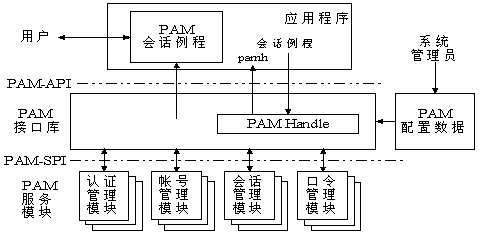
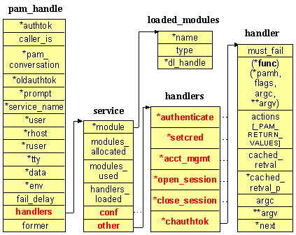
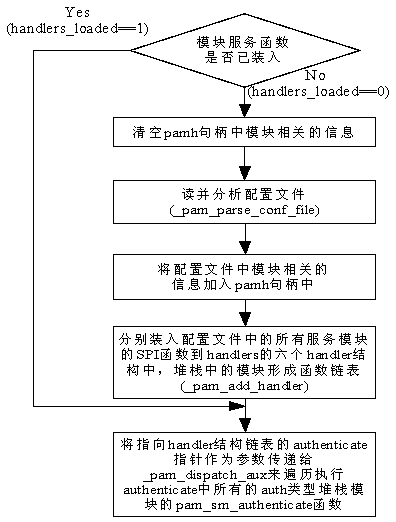

## PAM

> PAM 可插拔认证模块，设计初衷是将不同的底层认证机制集中到一个高层的API中。免去应用程序中进行认证逻辑。

### PAM 概述

#### PAM 的认证类别(type)

- account: 在用户能不能使用某服务上具有发言权，但不负责身份认证。比如，account 这个 type 可以检查用户能不能在一天的某个时间段登录系统、这个用户有没有过期、以及当前的登录用户数是否已经饱和等等。通常情况下，在登录系统时，如果你连 account 这个条件都没满足的话，即便有密码也还是进不去系统的。
- auth: 一般来说，询问你密码的就是这个 type。假如你的验证方式有很多，比如一次性密码、指纹、虹膜等等，都应该添加在 auth 下。auth 做的另外一件事情是权限授予，比如赋给用户某个组的组员身份等等。
- password: 主要负责和密码有关的工作。修改密码的时候有时会提示“密码不够长”、“密码是个常用单词”之类的，就是在这里设置的。在这里还设置了保存密码时使用了哪种加密方式（比如现在常用的 SHA-512）。请注意，这里的密码不局限于 /etc/shadow 中的密码，有关认证 token 的管理都应该在此设置：如果你使用指纹登录 Linux，在设置新指纹时，如果希望首先验证这是人的指纹而不是狗的指纹，也应该放在这里。
- session: 一个“忙前忙后”的 type，它要在某个服务提供给用户之前和之后做各种工作。比如用户登录之前要将用户家目录准备好，或者在用户登录之后输出 motd 等等

#### PAM 配置

> 模块文件路径`/lib/security`或`/lib64/security`以动态库形式存在，取决于操作系统的位数。
> 配置文件路径:`/etc/pam.d/`和`/etc/pam.conf`。`/etc/pam.d/`存在，则忽略`/etc/pam.conf`

- 配置格式:
1. 服务名称就是PAM配置文件名
    ```
    工作类别        控制模式        模块路径        模块参数
    ```
2. 每一条前的'-'短线，表示若找不到模块导致无法被加载时，不会被记录在日志中
3. 工作类别、流程栈、控制模式
    - 工作类别: -
    - 流程栈: 它是认证时执行步骤和规则的堆叠。在某个服务的配置文件中，它体现在了配置文件中的自上而下的执行顺序中。栈是可以被引用的，即在一个栈（或者流程）中嵌入另一个栈。
    - 控制模式: 用于定义各个认证模块在给出各种结果时 PAM 的行为，或者调用在别的配置文件中定义的认证流程栈。该列有两种形式，一种是比较常见的“关键字”模式，另一种则是用方括号（[]）包含的“返回值=行为”模式。
4. 控制模式——关键字模式下
    ```
    session    include      postlogin
    -session   optional     pam_ck_connector.so
    ```
    - required: 本条没有满足，本次认证一定失败，但是认证过程不因此打断。整个栈运行结束后返回失败信号
    - requisite: 本条没满足，认证失败，终止整个栈并返回。
    - sufficient: 本条满足，且之前没有任何失败，则返回“认证成功”，若本条验证失败，则不对结果产生影响。
    - optional: 仅在整个栈中只有一个条目时才起作用，否则不起作用。
    - include: 将其它配置文件中的流程栈包含到当前未知
    - substack: 运行其它配置文件中的流程，并将整个运行结果作为该行的结果输出。同include区别：类似宏函数与函数的调用区别。
5. 控制模式——“"返回值=行为"模式
    ```c
    [value1=action1 value2=action2 ...]
    ```
 > 其中，valueN 的值是各个认证模块执行之后的返回值。有 success、user_unknown、new_authtok_reqd、default 等等数十种。其中，default 代表其他所有没有明确说明的返回值。返回值结果清单可以在 /usr/include/security/_pam_types.h 中找到，也可以查询 pam(3) 获取详细描述。

    - ignore：在一个栈中有多个认证条目的情况下，如果标记 ignore 的返回值被命中，那么这条返回值不会对最终的认证结果产生影响。
    - bad：标记 bad 的返回值被命中时，最终的认证结果注定会失败。此外，如果这条 bad 的返回值是整个栈的第一个失败项，那么整个栈的返回值一定是这个返回值，后面的认证无论结果怎样都改变不了现状了。
    - die：标记 die 的返回值被命中时，马上退出栈并宣告失败。整个返回值为这个 die 的返回值。
    - ok：在一个栈的运行过程中，如果 ok 前面没有返回值，或者前面的返回值为 PAM_SUCCESS，那么这个标记了 ok 的返回值将覆盖前面的返回值。但如果前面执行过的验证中有最终将导致失败的返回值，那 ok 标记的值将不会起作用。
    - done：在前面没有 bad 值被命中的情况下，done 值被命中之后将马上被返回，并退出整个栈。
    - N（一个自然数）：功效和 ok 类似，并且会跳过接下来的 N 个验证步骤。如果 N = 0 则和 ok 完全相同。
    - reset：清空之前生效的返回值，并且从下面的验证起重新开始。
    
> 实际上，“关键字”模式可以等效地用“返回值=行为”模式来表示。具体的对应如下：
> - required：
>   [success=ok new_authtok_reqd=ok ignore=ignore default=bad]
> - requisite：
>   [success=ok new_authtok_reqd=ok ignore=ignore default=die]
> - sufficient：
>   [success=done new_authtok_reqd=done default=ignore]
> - optional：
>   [success=ok new_authtok_reqd=ok default=ignore]

6. 模块参数

    模块参数用空格与模块路径相隔。该参数将只和特定模块相关，因此某个模块的文档中一定包含其参数的信息。如果需要在单个参数中使用空格，可以将整个参数用方括号（[]）包裹起来。

#### PAM 架构

1. PAM框架结构图

> 系统管理员通过PAM配置文件来制定不同应用程序的不同认证策略；应用程序开发者通过在服务程序中使用PAM API(pam_xxxx( ))来实现对认证方法的调用；而PAM服务模块的开发者则利用PAM SPI来编写模块（主要是引出一些函数pam_sm_xxxx( )供PAM接口库调用），将不同的认证机制加入到系统中；PAM接口库（libpam）则读取配置文件，将应用程序和相应的PAM服务模块联系起来



2. PAM 接口库源代码分析

> pam_handle和其他几个主要的数据结构（见../libpam/pam_private.h）及其之间的关系如下图所示



其中pam_handle包含认证的用户的token、用户名、应用程序名、终端名等信息，以及一个service结构。service结构包含服务模块的相关信息，各个域的含义是：

- module--该结构包含装载的模块的名字、类型（静态或动态模块）、链接句柄（装载模块时的句柄）
- modules_allocated--分配的模块数。
- modules_used--已使用的模块数。
- handlers_loaded--是否对操作(handlers结构)进行了初始化，handlers结构和初始化handlers见下面的介绍。

    | handle指针 | API 函数 | SPI函数 |
    | --- | --- | --- |
    | authenticate | pam_authenticate() | pam_sm_authenticate() |
    | setcred | pam_setcred() | pam_sm_setcred() |
    | acct_mgmt | pam_acct_mgmt() | pam_sm_acct_mgmt() |
    | open_session | pam_open_session() | pam_sm_open_session() |
    | close_session | pam_close_session() | pam_sm_close_session() |
    | chauthtok | pam_chauthtok() | pam_sm_chauthtok() |

    handler数据结构是最直接保存服务模块的SPI服务函数的地址及参数的结构，其包含的主要的域的含义如下：
    1. `(*func)`   该函数指针指向handlers所装载的服务模块的服务函数。
    2. `argc`、`**argv`   分别为`*func`所指向的函数的参数个数和参数列表。
    3. `*next`    指向堆栈模块中的下一个服务模块的服务函数。由此指针形成所有堆栈模块的服务函数链。

- conf--由应用程序相对应的配置文件指定的服务模块的handlers。
- other--为缺省配置文件指定的服务模块的handlers。

3. PAM认证 API 的实现

> 以下为 pam_authenticate 函数执行流程图。其他的认证API函数（pam_open_session等）执行过程前面五个步骤同上图，只是在最后一步时传递给_pam_dispatch_aux的指针参数不同，传递3.1节表中每个API函数相对应的那个handler型指针，然后执行相对应的SPI服务函数链。



### PAM 模块开发

1. Linux-PAM(Linux 的可插入身份验证模块)是一个 library，使本地系统管理员可以选择各个 applications 对用户进行身份验证的方式。
2. 在编写基于 PAM 的 application 时，必须以对 application 透明的方式提供这些服务。也就是说，在编写 application 时，不能对 client 的身份验证进行任何假设。
3. 认证的 process 由 PAM library 通过调用`pam_authenticate()`来执行。此 function 的 return value 将指示命名的 client(用户)是否已通过身份验证。
4. 如果 PAM library 需要提示用户输入任何信息，例如他们的 name 或密码，那么它将这样做。如果将 PAM library 配置为使用某种静默协议对用户进行身份验证，它也会这样做。 (后一种情况可能是通过 example.)的某些硬件接口。重要的是要注意，PAM library 有权决定 application 必须决定何时提示用户的所有决定
5. PAM library 对于不同风格的 application 必须同样有效。比如：字符界面和图形界面
6. application 为 PAM library 提供了对话功能。从 PAM library 内部调用此 function，并使 PAM 可以直接与 client 进行交互。该对话功能必须要做的事情是提示用户输入文本 and/or 来从用户那里获取文本输入，以供 PAM library 处理。稍后部分中将提供此功能的详细信息。
7. PAM 够通过调用`pam_setcred()`设置和删除用户凭据。在用户经过身份验证之后，并在向用户提供服务之前，应始终调用此 function。
8. 用户账户是否已过期 `pam_chauthtok()`
9. 会话`pam_open_session()`和`pam_close_session()`

#### PAM 模块API功能一览

2. PAM对话

    - PAM库使用应用程序定义的回调来允许已加载的模块和应用程序之间的直接通信。该回调由 事务开始时传递给 `pam_start()` 的 `struct pam_conv` 指定 
    - 当模块调用引用的`conv()`函数时，参数`appdata_ptr`设置为该结构的第二个元素。
    - `num_msg`: 持有指针数组msg的长度。成功返回之后，指针resp指向`pam_response`结构的数组，其中包含应用程序提供的文本。调用要使用 free() 释放此数组和响应本身

    - 消息的类型，由`struct pam_message`的`msg_style`成员指定

        | 类型 | 解释 |
        | --- | --- |
        | `PAM_PROMPT_ECHO_OFF` | 获取字符串而不回显任何文本 |
        | `PAM_PROMPT_ECHO_ON` | 回显文本的同时获取字符串 |
        | `PAM_ERROR_MSG` | 显示错误信息 |
        | `PAM_TEXT_INFO` | 显示一些文字 |

### PAM应用程序

> 应用程序不关心PAM配置和模块，只是去做验证

1. 应用程序编译

    ```c
    #include <security/pam_appl.h>
    cc -o application .... -lpam
    ```

    ```c
    #include <security/pam_appl.h>
    #include <security/pam_misc.h>
    cc -o application .... -lpam -lpam_misc
    ```

2. 初始化PAM

    ```c
    #include <security/pam_appl.h>
    int pam_start(service_name, user, pam_conversation, pamh);
    
    // 该服务名参数指定服务的名称申请，将被存储在新的环境PAM_SERVICE项目。
    // 该服务的策略将从文件中读取，/etc/pam.d/service_name或者如果该文件不存在，则从中读取/etc/pam.conf。
    const char *service_name;

    // 指定目标用户的名称，将被存储为PAM_USER项目
    // 参数为NULL,则模块必须在必要时询问该项目
    const char *user;

    // pam_conversation 指向一个描述会话功能的结构体
    // 可以在加载的模块和应用程序之间进行直接通信
    const struct pam_conv *pam_conversation;

    // 调用返回 PAM_SUCCESS 之后，pamh内容是一个句柄，其中包含用于后续调用PAM函数的PAM上下文。
    // 错误返回 NULL
    pam_handle_t **pamh;
    ```
> 该`pam_start`函数创建PAM上下文并启动PAM事务。它是应用程序需要调用的第一个PAM函数。事务状态完全包含在此句柄标识的结构内，因此可以并行处理多个事务。

    - 返回值
        | 宏 | 含义 |
        | --- | --- |
        | `PAM_ABORT` | 一般失败 |
        | `PAM_BUF_ERR` | 内存缓冲区错误 |
        | `PAM_SUCCESS` | 事务已成功创建 |
        | `PAM_SYSTEM_ERR` | 系统错误，例如提供了NULL指针，而不是数据指针 |

3. 终止PAM
    
    ```c
    #include <security/pam_appl.h>
    int pam_end (pamh, pam_status);

    pam_handle_t *pamh;

    // 此为最后的PAM库调用返回给应用程序的值
    int pam_status;
    ```

    - 返回值
        | 宏 | 含义 |
        | --- | --- |
        | PAM_SUCCESS | 成功 |
        | PAM_SYSTEM_ERR | 系统错误 |

4. 获取和设置 PAM ITEM 和 数据

    ```c
    /**
     * pam_handle_t *pamh;
     * const char *module_data_name;
     * void *data;
     * void (*cleanup)(pam_handle_t *pamh, void *data, int error_status);
     */
    int pam_set_data (pamh, module_data_name, data, (*cleanup)(pam_handle_t* pamh, void* data, int error_status));

    /**
     * const pam_handle_t *pamh;
     * const char *module_data_name;
     * const void **data;
     */
    int pam_get_data (pamh, module_data_name, data);
    ```

    - `pam_set_item` 允许程序和PAM服务模块更新 `item_type` 的PAM信息
    - `pam_get_item` 允许程序和PAM服务模块访问 `item_type` 的PAM信息

        | set/get宏 | 说明 |
        | --- | --- |
        | `PAM_SERVICE` | 服务名 |
        | `PAM_USER` | 提供身份服务的实体用户名 |
        | `PAM_USER_PROMPT` | 提示用户输入 name 时使用的 string。此string的默认值是 'login:' 的本地化 |
        | `PAM_TTY` | 终端名，如果是设备文件，则以`/dev/`为前缀，对于图形界面，此值是 $DISPLAY 变量 |
        | `PAM_RUSER` | 请求用户名，本地请求用户的本地名或远程请求用户的远程名 |
        | `PAM_RHOST` | 正在请求的主机名 |
        | `PAM_AUTHTOK` | 认证令牌（通常是密码）。除`pam_sm_authenticate()` 和 `pam_sm_chauthok()`外，所有模块功能都应该忽略此令牌 |
        | `PAM_OLDAUTHTOK` | 旧的身份令牌。除`pam_sm_chauthtok`外所有模块都应该忽略此令牌 |
        | `PAM_CONV` | `pam_conv` 结构 |
        | `PAM_FAIL_DELAY` | 用于重定向集中管理的故障延迟 (特定Linux-PAM) |
        | `PAM_XDISPLAY` | X显示的名称 （特定Linux-PAM）|
        | `PAM_XAUTHDATA` | 指向包含X认证数据结构的指针，该数据需要与 `PAM_XDISPLAY` 指定的显示器建立连接。`pam_xauth_data()` （特定Linux-PAM）|
        | `PAM_AUTHTOK_TYPE` | 默认操作是在请求密码时使用以下提示： "New UNIX password:" 和 "Retype UNIX password:"默认情况下未空`pam_get_authtok`（特定Linux-PAM）|

    - 返回值
        | 返回宏 | 说明 |
        | --- | --- |
        | PAM_BAD_ITEM | application尝试设置未定义或无法访问的item |
        | PAM_BUF_ERR | 内存缓冲区错误 |
        | PAM_SUCCESS | 数据更新成功 |
        | PAM_CONV_ERR | 应用程序提供的对话方法无法获取用户名 |
        | PAM_SYSTEM_ERR | 作为第一个参数传递的 `pam_handle_t` |

5. 描述PAM错误的字符串

    ```c
    #include <security/pam_appl.h>
    
    const char *pam_strerror (pamh, errnum);	 

    pam_handle_t *pamh;
    int errnum;
    ```
> 该`pam_strerror`函数返回指向描述在参数errnum中传递的错误代码的字符串的指针，可能使用当前语言环境的`LC_MESSAGES`部分来选择适当的语言。该字符串不得由应用程序修改。没有库函数将修改此字符串。

    - 返回值：此函数始终返回指向字符串的指针

6. 请求失败延迟

    ```c
    #include <security/pam_appl.h>
    int pam_fail_delay (pamh, usec);	 

    pam_handle_t *pamh;
    unsigned int usec;
    ```
> 该`pam_fail_delay`功能提供了一种机制，应用程序或模块可通过该机制建议usc微秒的最小延迟。该功能记录该功能请求的最长时间。如果`pam_authenticate`失败，则失败的返回到应用程序的时间将延迟大约此最长值随机分布的时间（最多25％）。
> 与成功无关，当PAM服务模块将控制权返回给应用程序时，延迟时间将重置为其默认值零。在调用所有身份验证模块之后，但在将 控制权返回给服务应用程序之前，将发生延迟。

    - 使用此功能须检查功能是否可用
    
        ```c
        #ifdef HAVE_PAM_FAIL_DELAY
        ...
        #endif
        ```

> 对于事件驱动的程序，使用此延迟是不被希望的，对于其它程序可能希望以其它方式注册延迟。可用`pam_get_item`/`pam_set_item` 查询设置函数指针

        ```c
        void (*delay_fn)(int retval, unsigned usec_delay, void *appdata_ptr);
        ```

7. 验证

> 该`pam_authenticate`功能用于验证用户。要求用户根据身份验证服务提供身份验证令牌，通常这是密码，但也可以是指纹。
> PAM服务模块可以请求用户通过对话机制输入其用户名(参看`pam_start`和 `pam_conv`)
> 通过身份验证的用户名将出现在PAM项`PAM_USER`中。可以通过调用`pam_get_item`来恢复该项目 。

    ```c
    #include <security/pam_appl.h>
    int pam_authenticate (pamh, flags);	 
    pam_handle_t *pamh;
    int flags;
    ```

    - flags 参数可以是如下：
        | 宏 | 含义 |
        | --- | --- |
        | PAM_SILENT | 不要发出任何消息 |
        | PAM_DISALLOW_NULL_AUTHTOK | 如果用户没有注册的身份验证令牌，则PAM模块服务应返回PAM_AUTH_ERR |

    - 返回值

        | 宏 | 含义 |
        | --- | --- |
        | PAM_ABORT | 调用pam_end之后调用此值 |
        | PAM_AUTH_ERR | 用户未通过身份验证 |
        | PAM_CRED_INSUFFICIENT | 由于某种原因，程序没有足够的凭据验证用户身份 |
        | PAM_AUTHINFO_UNVAIL | 模块无法访问身份验证信息。可能是网络或硬件故障引起 |
        | PAM_MAXTRIES | 一个或多个身份验证模块已达到尝试对用户进行身份验证的限制，不要再试一次 |
        | PAM_SUCCESS | 用户已成功认证 |
        | PAM_USER_UNKNOWN | 身份验证服务未知的用户 |

8. 用户身份凭证

    ```c
    #include <security/pam_appl.h>

    int pam_setcred(pamh, flags);	 
    pam_handle_t *pamh;
    int flags;
    ```

    - flag

        | 宏 | 含义 |
        | --- | --- |
        | PAM_ESTABLISH_CRED | 初始化用户的凭据 |
        | PAM_DELETE_CRED | 删除用户的凭据 |
        | PAM_REINITIALIZE_CRED | 完全重新初始化用户的凭据 |
        | PAM_REFRESH_CRED | 延长现有凭证的寿命 |

    - 返回值

        | 宏 | 含义 |
        | --- | --- |
        | PAM_BUF_ERR | 内存缓冲区错误 |
        | PAM_CRED_ERR | 设置用户凭证失败 |
        | PAM_CRED_EXPIRED | 用户凭证已过期 |
        | PAM_CRED_UNAVAIL | 无法检索用户凭据 |
        | PAM_SUCCESS | 数据已成功存储 |
        | PAM_SYSTEM_ERR | 系统错误 |
        | PAM_USER_UNKNOWN | 身份验证模块未知用户 |

9. 账户验证管理

> 该`pam_acct_mgmt`函数用于确定用户帐户是否有效。它检查身份验证令牌和帐户到期并验证访问限制。通常在用户通过身份验证后调用。

    ```c
    #include <security/pam_appl.h>
    int pam_acct_mgmt(pamh, flags);	 

    pam_handle_t *pamh;
    int flags;
    ```

    - flags 取值

        | 宏 | 含义 |
        | --- | --- |
        | PAM_ACCT_EXPIRED | 用户账户已过期 |
        | PAM_AUTH_ERR | 验证失败 |
        | PAM_NEW_AUTHTOK_REQD | 用户账户有效，但其身份验证令牌已过期。此返回值的正确响应是要求用户pam_chauthtok()在获得服务之前满足该功能。某些应用程序可能无法执行此操作。在这种情况下，应拒绝用户访问权限，直到他们可以更新密码为止。|
        | PAM_PERM_DENIED | 没有权限 |
        | PAM_SUCCESS | 身份验证令牌已成功更新 |
        | PAM_USER_UNKNOWN | 密码服务未知的用户 |

10. 更新身份验证令牌

> 该`pam_chauthtok`功能用于更改给定用户的身份验证令牌

    ```c
    #include <security/pam_appl.h>
    int pam_chauthtok(pamh, flags);	 

    pam_handle_t *pamh;
    int flags;
    ```

    - flags 参数和含义
        | 宏 | 含义 |
        | --- | --- |
        | PAM_SILENT | 不发出任何消息 |
        | PAM_CHANGE_EXPIRED_AUTHTOK | 此参数向模块只是仅当用户身份验证令牌已过期时才对其进行更改。如果没传递此参数，应用程序更改所有身份验证令牌 |

    - 返回值

        | 宏 | 含义 |
        | --- | --- |
        | PAM_AUTHTOK_ERR | 模块无法获取新的身份验证令牌 |
        | PAM_AUTHTOK_RECOVERY_ERR | 模块无法获取旧的身份验证令牌 |
        | PAM_AUTHTOK_LOCK_BUSY | 一个或多个模块无法更改身份验证令牌，因为它处于锁定状态 |
        | PAM_AUTHTOK_DISABLE_AGING | 至少其中一个模块的身份验证令牌过期已禁用 |
        | PAM_PERM_DENIED | 没有权限 |
        | PAM_SUCCESS | 身份验证令牌已成功更新 |
        | PAM_TRY_AGAIN | 并非所有模块都可以更新身份验证令牌。这种情况下，不会更新用户身份验证令牌 |
        | PAM_USER_UNKNOWN | 密码服务未知的用户 |

11. 开始PAM会话管理

> 该`pam_open_session`功能为先前成功通过身份验证的用户设置用户会话。稍后应通过调用`pam_close_session`终止会话 。

    ```c
    #include <security/pam_appl.h>
    int pam_open_session (pamh, flags);	 

    pam_handle_t *pamh;
    int flags;
    ```

    - flags
        | 宏 | 含义 |
        | --- | --- |
        | PAM_SILENT | 不要发出任何消息 |

    - 返回值

        | 宏 | 含义 |
        | --- | --- |
        | PAM_ABORT | 一般失败 |
        | PAM_BUF_ERR | 内部缓冲区错误 |
        | PAM_SESSION_ERR | 会话失败 |
        | PAM_SUCCESS | 会话创建成功 |

12. 终止PAM会话管理

> 该`pam_close_session`功能用于指示已认证的会话已结束。
> 有效的uid geteuid 应具有足够的特权来执行诸如卸载用户主目录之类的任务

    ```c
    #include <security/pam_appl.h>
    int pam_close_session (pamh, flags);	 

    pam_handle_t *pamh;
    int flags;
    ```

    - flags
        | 宏 | 含义 |
        | --- | --- |
        | PAM_SILENT | 不要发出任何消息 |

    - 返回值

        | 宏 | 含义 |
        | --- | --- |
        | PAM_ABORT | 一般失败 |
        | PAM_BUF_ERR | 内存缓冲区错误 |
        | PAM_SESSION_ERR | 会话失败 |
        | PAM_SUCCESS | 会话已成功终止 |

13. 设置/更改PAM环境变量

    ```c
    #include <security/pam_appl.h>
    int pam_putenv (pamh, name_value);	 

    pam_handle_t *pamh;
    const char *name_value;
    ```

> 该`pam_putenv`函数用于添加或更改与pamh句柄关联的PAM环境变量的值

    - `name_value`格式: "NAME=VALUE"，NAME已存在则被覆盖，否则将添加到PAM环境中;"NAME="表示空值，允许这样设置; "NAME"表示删除PAM环境中相应的变量
    - 返回值
        | 宏 | 含义 |
        | --- | --- |
        | PAM_PERM_DENIED | 给定参数name_value是NULL指针 |
        | PAM_BAD_ITEM | 当前未设置请求的变量(用于删除) |
        | PAM_ABORT | 该句柄已损坏 |
        | PAM_BUF_ERR | 内存缓冲区错误 |
        | PAM_SUCCESS | 环境变量已成功更新 |

14. 获取PAM环境变量

    ```c
    #include <security/pam_appl.h>
    const char *pam_getenv (pamh, name);	 

    pam_handle_t *pamh;
    const char *name;
    ```
> `pam_getenv` 函数在与句柄关联的环境中搜索指向字符串的匹配项，并返回指向环境变量的指针，不允许释放该指针。

15. 获取PAM环境变量链表

> 返回环境变量的副本，需要释放

    ```c
    #include <security/pam_appl.h>
    char **pam_getenvlist(pamh);	 
    pam_handle_t *pamh;
    ```

16. 对话功能

> PAM库使用应用程序定义的回调来允许已加载的模块和应用程序之间的直接通信。
> 拥有消息数组的意义在于，有可能在一次来自模块的调用中将许多东西传递给应用程序。对于应用程序来说，关联的事物一下子出现也很方便

    ```c
    #include <security/pam_appl.h>
    
    struct pam_message {
        int msg_style;
        const char *msg;
    };

    struct pam_response {
        char *resp;
        int resp_retcode;
    };

    struct pam_conv {
        int (*conv)(int num_msg, const struct pam_message **msg, struct pam_response **resp, void *appdata_ptr);
        void *appdata_ptr;
    };
    ```

    - 消息类型(由`struct pam_message` 的`msg_style`成员指定)
    | 宏 | 含义 |
    | --- | --- |
    | PAM_PROMPT_ECHO_OFF | 获取字符串而不回显任何文本 |
    | PAM_PROMPT_ECHO_ON | 在回显文本的同时获取字符串 |
    | PAM_ERROR_MSG | 显示错误信息 |
    | PAM_TEXT_INFO | 显示一些文字 |

    - 为了维护两个PAM实现与源代码级的兼容性，两个已知的模块编写器变通办法是
    
        1. 永远不要调用 `num_msg`大于1的对话函数
        2. 将msg设置为双重引用，以便两种类型的对话功能都可以找到消息，也就是说，使 `msg[n]=&(((*msg)[n]))`

    - 返回值
        | 宏 | 含义 |
        | --- | --- |
        | PAM_BUF_ERR | 内存缓冲区错误 |
        | PAM_CONV_ERR | 通话失败，该应用不应设置*resp |
        | PAM_SUCCESS | 成功 |

    ```c

> 注意：所有身份验证服务函数调用都接受`PAM_SILENT`令牌，该令牌指示模块不向应用程序发送消息

#### 用户身份

- 在Linux的PAM模块将需要确定谁请求服务，谁授予该服务的用户的身份，用户的身份。这两个用户很少相同。实际上，通常需要考虑第三个用户身份，即在授予服务后用户的新（假定）身份。
- 一种约定是:
    1. 请求服务的用户的身份应该是正在运行的进程的当前UID(用户ID)
    2. 特权授予用户的身份是正在运行的进程的EUID(有效用户ID)
    3. 给定`PAM_USER`

#### 头文件

```c
/usr/include/security/pam_appl.h
Header file with interfaces for Linux-PAM applications.

/usr/include/security/pam_misc.h
Header file for useful library functions for making applications easier to write.
```


### 文档

- [PAM程序开发](http://www.linux-pam.org/Linux-PAM-html/)
- [文档](http://v.colinlee.fish/posts/pam-tutorial-1-intro.html)
- [文档](https://www.docs4dev.com/docs/zh/linux-pam/1.1.2/reference/adg-interface-by-app-expected.html)
